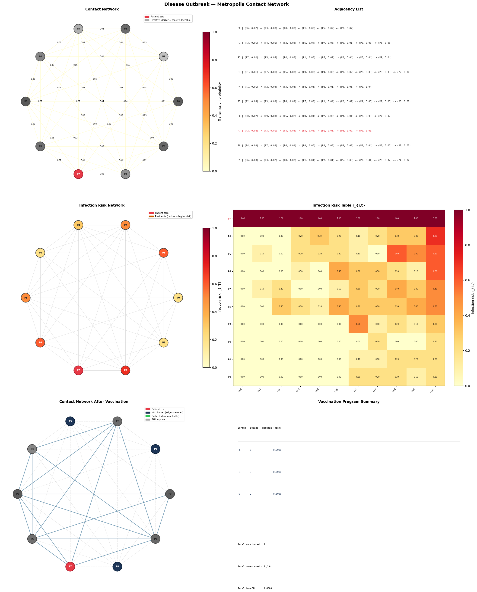

# Graph Algorithms in Action: Modelling a Disease Outbreak

**Course:** Algorithms and Analysis — COSC2123/3119
**University:** RMIT University

---

## Overview

This assignment models a disease outbreak in the city of Metropolis as a weighted contact
graph, where each node represents a resident and each edge represents a contact relationship
with an associated daily transmission probability. Using this model, you will implement
efficient graph representations, compute infection risk across a planning horizon, and design
a dynamic programming strategy to allocate a limited supply of antiviral doses as effectively
as possible.

---

## Tasks

| Task | Marks | Description |
|------|-------|-------------|
| **A** | 5 | Implement an adjacency matrix graph representation |
| **B** | 7 | Implement a dynamic programming solution to compute infection risk |
| **C** | 8 | Theoretical and empirical analysis of all algorithm and representation combinations (report only) |
| **D** | 10 | Implement a antiviral allocation strategy |

---

### Task A — Adjacency Matrix (5 marks)

**File to edit:** `graph/adjacency_matrix.py`

An adjacency list representation is provided as a reference in `graph/adjacency_list.py`.
Your task is to implement the `AdjacencyMatrix` class, which must expose exactly the same
public interface as `AdjacencyList` so that all downstream algorithms work correctly with
either representation by changing a single config value (`graph_type`).

The matrix stores edge weights in a 2D grid where `matrix[i][j]` holds the transmission
probability between resident `i` and resident `j`, or `0.0` if no edge exists. 

To test your implementation:
```bash
python -m tests.test_adjacency
```

---

### Task B — Infection Risk DP (7 marks)

**File to edit:** `transmission/task_b.py` — implement the `task_b` function.

A Monte Carlo baseline is provided in `transmission/monte_carlo.py` for comparison. Your task
is to implement the exact dynamic programming solution using the recurrence:

```
r[i][t] = 1 - (1 - r[i][t-1]) * product over Vj in N(Vi) of (1 - r[j][t-1] * w_ij)
```

where `r[i][t]` is the probability that resident `V_i` has been infected by the end of day `t`.

Your function must return the full `(T+1) x |V|` risk table as a `list[list[float]]`, where
`table[t][i]` is the infection risk for vertex `V_i` at day `t`.

Set `risk_solver` to `"task_b"` in the config to run your implementation.

To test your implementation:
```bash
python -m tests.test_risk
```

---

### Task C — Empirical Analysis (8 marks, report only)

**No implementation required.** Marks are awarded solely for the quality of your analysis,
experimental design, and discussion in the report.

You will compare all four combinations of algorithm and representation:
- `monte_carlo` with adjacency list
- `monte_carlo` with adjacency matrix
- `task_b` with adjacency list
- `task_b` with adjacency matrix

Use the timer utility in `utils/timer.py` to time each algorithm. Set `run_vaccine: false`
in the config to skip Task D when running timing experiments.

```python
from utils.timer import start, stop

start_time = start()
# ... algorithm to time ...
elapsed = stop(start_time)
print(f"Elapsed: {elapsed:.4f}s")
```

Time only the algorithm itself — do not include graph construction or file I/O.

---

### Task D — Antiviral Allocation (10 marks)

**File to edit:** `treatment/task_d.py` — implement the `task_d` function.

A brute-force baseline is provided in `treatment/vaccination_program.py` for comparison.
Your task is to implement an efficient solution, selecting the subset of eligible residents 
that maximises total benefit (infection risk) without exceeding the total dose capacity.

Your function receives a flat list of eligible `Person` objects (sorted by benefit descending,
patient zero excluded) and the total dose capacity. It must return:
- A list of vaccinated `Person` objects
- The total benefit achieved
- The total doses used
- The table used to calculate the best solution

Set `vaccine_strategy` to `"task_d"` in the config to run your implementation.

To test your implementation:
```bash
python -m tests.test_treatment
```

---

## File Structure

```
disease_spread/
    graph/
        graph.py                  # Abstract base class — DO NOT EDIT
        vertex.py                 # Base Vertex class — DO NOT EDIT
        edge.py                   # Base Edge class — DO NOT EDIT
        adjacency_list.py         # Adjacency list (reference) — DO NOT EDIT
        adjacency_matrix.py       # TASK A — implement this file
    simulation/
        person.py                 # Person class (extends Vertex) — DO NOT EDIT
        city.py                   # Builds the contact graph from config — DO NOT EDIT
    transmission/
        monte_carlo.py            # Monte Carlo baseline (reference) — DO NOT EDIT
        task_b.py                 # TASK B — implement this file
    treatment/
        vaccination_program.py    # Brute-force baseline (reference) — DO NOT EDIT
        task_d.py                 # TASK D — implement this file
    utils/
        config_validator.py       # Config validation — DO NOT EDIT
        simulation_utils.py       # Simulation helpers — DO NOT EDIT
        timer.py                  # Timer utility — DO NOT EDIT
        visualise.py              # Visualisation — DO NOT EDIT
    visuals/                      # Generated PDF visualisations saved here
    simulate_outbreak.py          # Main entry point — DO NOT EDIT
    task_c_analysis.py            # Task C timing script — DO NOT EDIT
    example_config.json           # Example configuration file
```

---

## Requirements

This project requires Python 3.13+ and a single external library:

```
matplotlib
```

Install with pip:
```bash
pip install matplotlib
```

Or with conda:
```bash
conda install matplotlib
```

---

## Running the Program

Copy `example_config.json` to `config.json` (or any name you like), edit as needed, then run:

```bash
python simulate_outbreak.py config.json
```

---

## Configuration

All simulation parameters are controlled via a JSON config file. The following keys are required:

| Key | Type | Description |
|-----|------|-------------|
| `seed` | `int` | Random seed for reproducibility |
| `num_residents` | `int` | Number of residents in the city (`> 0`) |
| `num_edges` | `int` | Exact number of edges to generate — at most `|V|*(|V|-1)/2` |
| `max_transmission_prob` | `float` | Maximum edge weight — in `[0.0002, 1.0]` |
| `vulnerability_range` | `[float, float]` | Min and max vulnerability values for residents |
| `dosage_range` | `[int, int]` | Min and max antiviral dosage requirements for residents |
| `graph_type` | `str` | Graph representation — `"list"` or `"matrix"` |
| `risk_solver` | `str` | Risk solver — `"monte_carlo"` or `"task_b"` |
| `time_horizon` | `int` | Planning horizon T in days (`> 0`) |
| `simulations` | `int` | Number of Monte Carlo simulations (`> 0`) |
| `total_doses` | `int` | Total antiviral doses available (`> 0`) |
| `vaccine_strategy` | `str` | Vaccine allocation strategy — `"brute_force"` or `"task_d"` |
| `run_vaccine` | `bool` | Whether to run the vaccine program (set `false` for Task C timing) |
| `print_struct` | `bool` | Print the graph structure to the console |
| `visualise` | `bool` | Generate and save a visualisation PDF |
| `visual_filename` | `str` | Filename (without extension) for the saved visualisation |

### Example Config

```json
{
    "seed": 42,
    "num_residents": 15,
    "num_edges": 30,
    "max_transmission_prob": 1.0,
    "vulnerability_range": [0.1, 1.0],
    "dosage_range": [1, 5],
    "graph_type": "list",
    "risk_solver": "monte_carlo",
    "time_horizon": 30,
    "simulations": 100,
    "total_doses": 20,
    "vaccine_strategy": "brute_force",
    "run_vaccine": true,
    "print_struct": false,
    "visualise": true,
    "visual_filename": "outbreak_visual"
}
```

---

## The Disease Model

The contact network is modelled as a weighted undirected graph G = (V, E) where:

- Each vertex V_i represents a resident of Metropolis with:
  - `state` — infected (`True`) or healthy (`False`)
  - `vulnerability` — float in the range defined by `vulnerability_range`
  - `dosage_requirement` — int in the range defined by `dosage_range`

- Each edge (V_i, V_j) carries a weight w_ij ∈ (0, `max_transmission_prob`] representing
  the daily transmission probability between residents V_i and V_j.

- Patient zero is assigned randomly using the seed.

### Infection Risk

The infection risk `r[i][t]` for resident V_i at day t is computed using the recurrence:

```
r[i][0] = 1.0  if V_i is patient zero, else 0.0

r[i][t] = 1 - (1 - r[i][t-1]) * product over Vj in N(Vi) of (1 - r[j][t-1] * w_ij)
```

The final column `r[i][T]` gives each resident's infection risk score, used directly
as their benefit value in the vaccine allocation program.

---

## Visualisation

If `visualise` is set to `true`, a PDF is saved to the `visuals/` folder. The layout
adapts based on what has been computed:

| Row | Left panel | Right panel |
|-----|-----------|-------------|
| 1 | Contact network | Graph representation (list or matrix) |
| 2 | Infection risk network | Full risk table r_{i,t} heatmap |
| 3 | Contact network after vaccination | Vaccination program summary |

Row 2 appears after the risk solver runs. Row 3 appears after the vaccine program runs.

### Example Output

The following is an example visualisation produced by the simulation with 12 residents,
20 edges, and seed 2:



---

## Academic Integrity

This is an individual assignment. Do not share your code or copy from others.
Only edit the files explicitly marked with `# EDIT THIS FILE TO IMPLEMENT TASK X`.
Any changes outside these marked files may cause your submission to fail automated tests.

You are expected to use git version control and commit regularly with clear, meaningful
commit messages. Submissions with no evidence of incremental development will receive
zero marks regardless of correctness.
